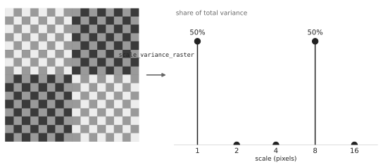

# scalevar

**Scale variance decomposition for hierarchical data.**

<p align="center">
  
  <br>
  <sub>Worked example: Moellering &amp; Tobler (1972), Figure 3</sub>
</p>

<p align="center">
  <a href="https://jacobdein.github.io/scale-variance/playground/"><strong>↗ Try it in your browser →</strong></a>
  &nbsp;·&nbsp;
  <a href="https://jacobdein.github.io/scale-variance/">Docs</a>
</p>

`scalevar` partitions the total variance of a variable measured across a nested hierarchy into the share attributable to each level of that hierarchy. It is a direct implementation of the method introduced by Moellering and Tobler (1972), *Geographical Variances*.

## Status

| Package | Version | Install |
|---------|---------|---------|
| **Python** (`python/`) | **v0.1.0** (current) | `pip install git+https://github.com/jacobdein/scale-variance.git#subdirectory=python` |
| **R** (`r/`) | v0.2.0 (planned) | see [ROADMAP.md](ROADMAP.md) |

Both packages target the same API contract in [`docs/api-design.md`](docs/api-design.md) and share a hand-derived fixture suite under [`tests/fixtures/`](tests/fixtures) (gold standard: Moellering & Tobler Figure 3, with the paper's published totals `TSS = 1152`, `TDF = 255`). The Python package ships first; the R sibling follows in v0.2 alongside a cross-language parity harness.

## What is scale variance?

Given a quantity measured across observation units — raster pixels, survey points, administrative areas — and a nested hierarchy that groups those units into successively coarser parents, scale variance answers:

> Of the total variation in this quantity, how much is explained by differences *within* each hierarchical scale?

The decomposition follows a fully-nested fixed-effects ANOVA (Moellering & Tobler Eq. 12):

```
SS_total  =  SS_level_1  +  SS_level_2  +  ...  +  SS_level_k
```

Each `SS_level_n` is the variation explained by moving from the finer level `n` to the next coarser level `n+1`. Dividing by `SS_total` gives the **share of variance attributable to that scale** — the output column `ss_share`, which sums to 1 across levels.

See [`docs/theory.md`](docs/theory.md) for the full derivation, and the 1972 paper at [`reference/Moellering-1972-Geographical Variances.pdf`](reference/Moellering-1972-Geographical%20Variances.pdf).

## What `scalevar` is good for

`scalevar` is built for spatial scale analysis — rasters like NDVI or land cover, and nested polygon hierarchies like admin boundaries or watersheds. These are the cases the 1972 paper, and nearly all published applications, target.

- **Raster analysis.** NDVI, land cover, elevation, species density, population density, nighttime lights — anywhere you want to ask "at what scale does most of the variation live?"
- **Polygon hierarchies.** Admin boundaries (tract → county → state), watershed hierarchies, political districts.

A thin optional spatial module builds regular nested grids on top of `geopandas` (and `sf` once the R package lands) for users who want the Moellering & Tobler workflow out of the box.

Under the hood the algorithm is a nested fixed-effects ANOVA decomposition — the original paper even introduces it with a non-geographic example (academic salaries across departments, colleges, and universities). The tabular core `scale_variance` therefore works on any nested hierarchy with a scalar value at the leaves, spatial or not. However, this implementation is intended for hierarchies that have some relationship to geographic or spatial scale.

## Quick start

### Raster input (the main path)

```python
import rioxarray as rxr
from scalevar import scale_variance_raster

ndvi = rxr.open_rasterio("ndvi.tif").squeeze()

result = scale_variance_raster(ndvi, base_level_factor=2, agg_fun="mean")
print(result.components)
#    level  scale  sum_squares   df  mean_square  ss_share  ms_share  ss_cumulative
# 0      1   10.0       1.8e+5  ...          ...     0.050       ...          0.050
# 1      2   20.0       3.2e+5  ...          ...     0.087       ...          0.137
# ...
print(f"TSS={result.total_ss:.0f}, grand_mean={result.grand_mean:.3f}")
```

### Tabular input (custom hierarchies)

```python
import pandas as pd
from scalevar import scale_variance

df = pd.DataFrame({
    "county_id":  [1, 2, 3, 4, 5, 6, 7, 8],
    "state_id":   [1, 1, 2, 2, 3, 3, 4, 4],
    "region_id":  [1, 1, 1, 1, 2, 2, 2, 2],
    "value":      [10.0, 20.0, 30.0, 40.0, 50.0, 60.0, 70.0, 80.0],
})

result = scale_variance(
    df,
    value="value",
    id_cols=["county_id", "state_id", "region_id"],
)
```

See [`python/README.md`](python/README.md) for the full Python quick-start and three worked example notebooks.

## License

MIT — see [`LICENSE`](LICENSE).

## See also

- [`ROADMAP.md`](ROADMAP.md) for what's planned in v0.2 and beyond.
- [`CHANGELOG.md`](CHANGELOG.md) for release notes.
- [`docs/`](docs/) for the theory, the shared API design, and the cross-language parity testing plan.
- [`reference/`](reference/) for the 1972 paper and the original research-codebase R implementations the packages are being extracted from.
